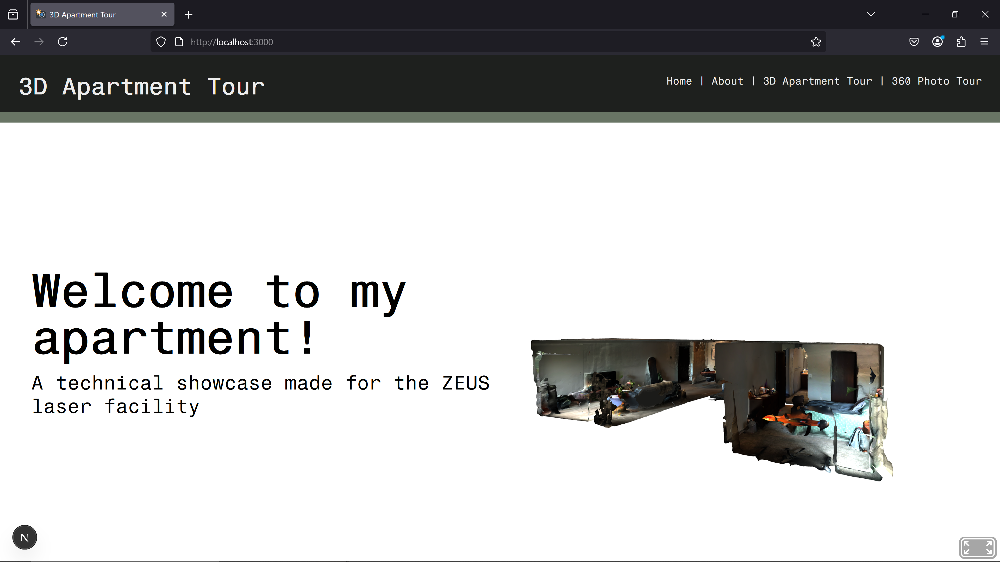
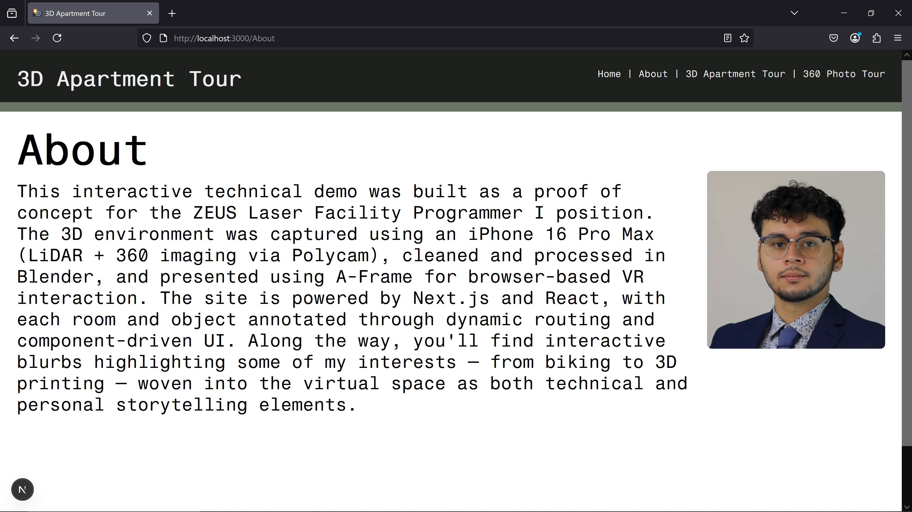

# Apartment Tour – Interactive 3D Web Demo

This project is a technical proof of concept built for an interview at the University of Michigan. It showcases a fully interactive 3D apartment tour designed for browser-based VR, with dynamically routed UI components and spatial storytelling.

## Built With

- **Capture**  
  - iPhone 16 Pro Max using LiDAR scanning and 360° imaging with Polycam

- **Post-Processing**  
  - Mesh cleaned, reduced, and annotated in Blender

- **Frontend & VR Layer**  
  - Developed with Next.js and React  
  - 3D environment rendered using A-Frame (WebXR-compatible)  
  - Rooms and objects annotated through dynamic routing and component-driven UI

## Features

- Fully navigable virtual apartment space in both 3D VR and photosphere styles
- Dynamic, contextual pop-ups for each room and major objects
- Interactive blurbs embedded within the scene to showcase personal interests such as:
  - Biking
  - 3D printing
  - Plant care

These interactive elements serve to merge technical demonstration with a bit of personal storytelling.

## Screenshots

### Home Page

### About Section

### 3D Tour

### Photosphere Tour View

